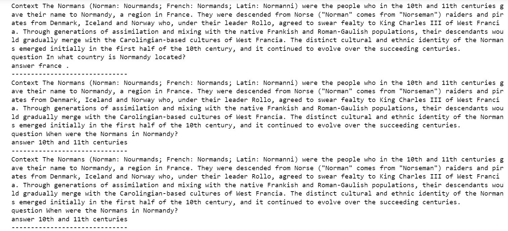
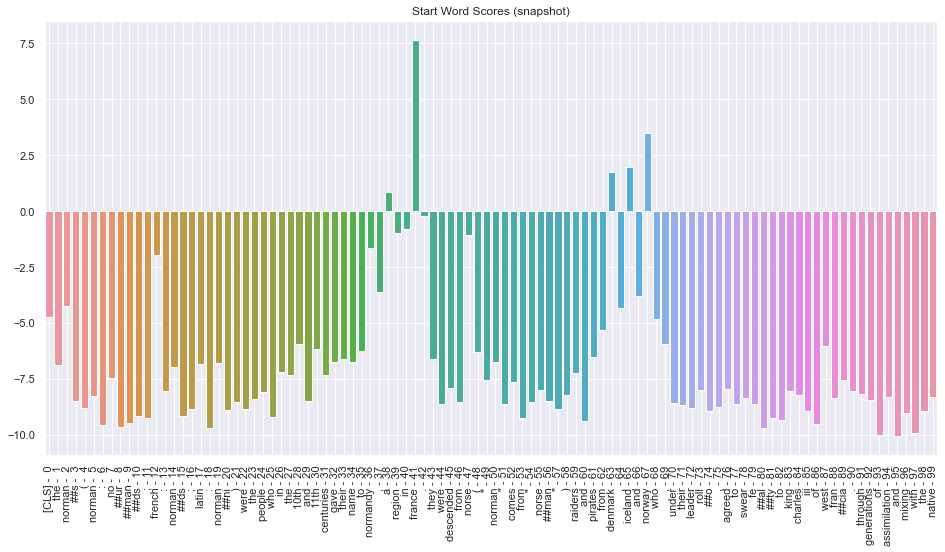
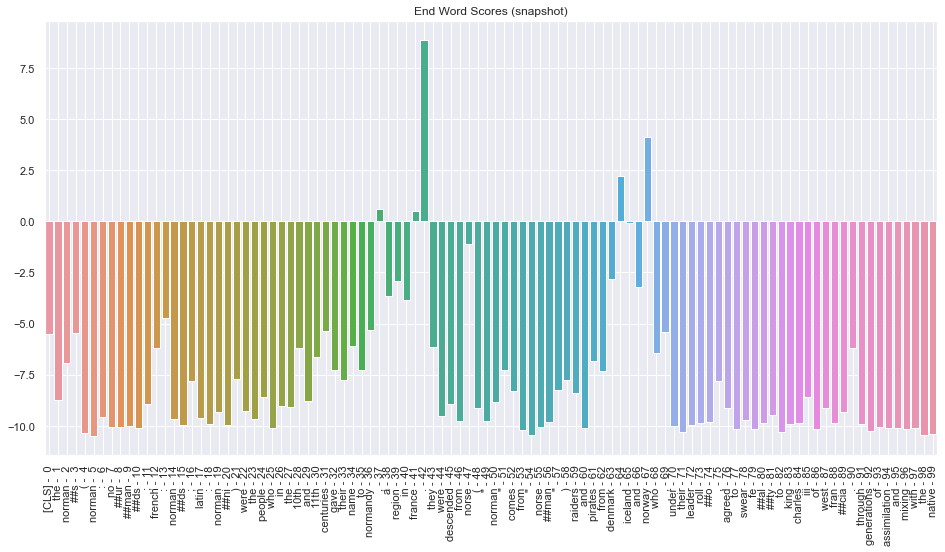

# Question-Answering-model
SQuAD - Question Answering model

---

## Introduction

Our goal is to create a question-answering model. The data set we use is the Stanford Question Answering Data Set (SQuAD), specifically SQuAD1.1. We intend to take two approaches to this problem: building an information  retrieval model and experimenting with BERT model and other BERT like models on the data set. 

---

## Required package installation:
```
sklearn
PyTorch
Transformers
Gensim>=4.0
nltk
tqdm
```

---

## DATA


---

## Infomation Retival Approach results:

| Model                        | train accuracy           | val accuracy |
| ---------------------------- | ------------------------ | ------------ |
| word2vec on context+Question with low freq words replaced | 71.2%                    | 72.5%        |
| word2vec-google-news-300     | NA(took too long to run) | 72.2%        |
| Fasttext on context+Question with low freq words replaced | 71%                      | 71%          |
| Fasttext on context+Question without replacement | 70.9%                      | 70.8%          |

---

## Transformer model Results:

| Model                        | Exact Match         | F1-score |
| ---------------------------- | ------------------------ | ------------ |
| BERT | 62.53%                    | 74.15%        |
| DistilBERT     | 62.23% | 75.02%        |
| Ensemble (BERT + DistilBERT)| 66.44%                      | 77.68%          |
| ALBERT | 70.9%                      | 80.95%          |

---

## Sample output:


---

## Output visualization:


