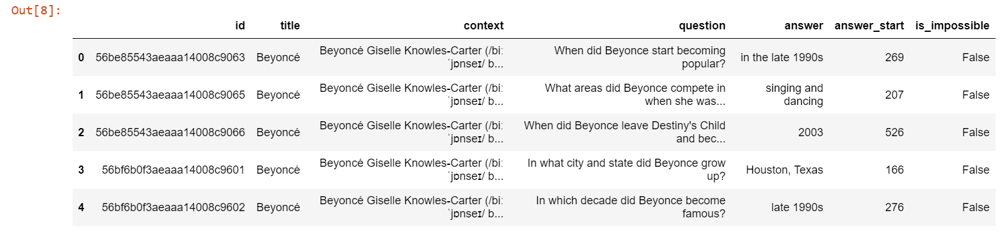
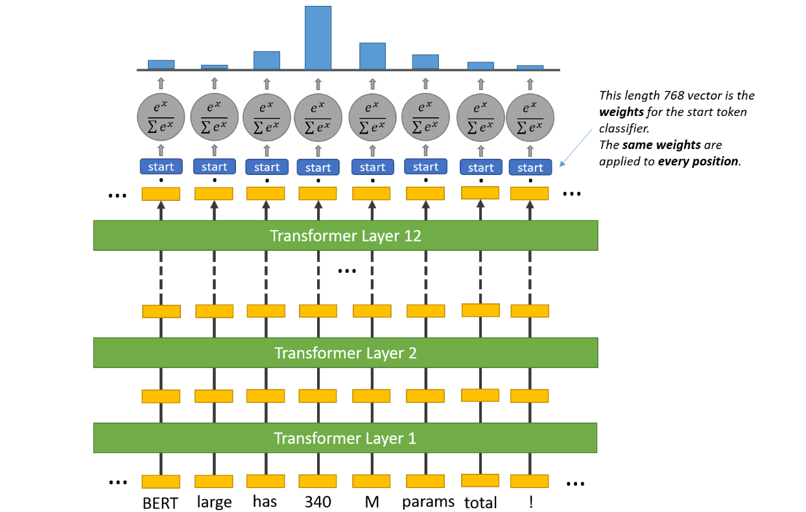
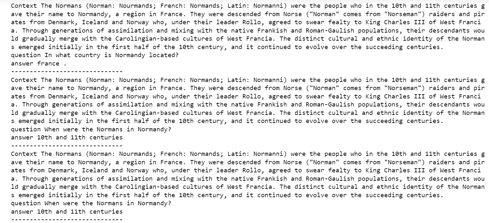
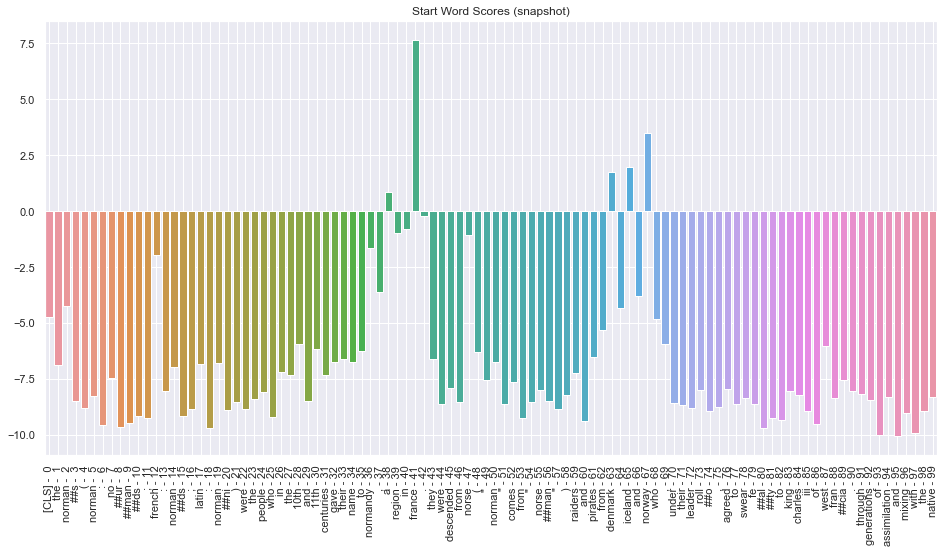

# Question Answering model

## Approach 2: Bert based models

### Methodology

#### 1.1 Dataset

- Dataset snapshot:

- But this dataset has only answer start index so to train Bert models we need the start and end indices.
- Once processed it looks like

---

#### 1.2 Creating the corpus

- The corpus for training was created by correcting the answer start index and adding the answer end indexes for each observation in the dataset.
- Then the question was concatenated to the context with a `[SEP]` token with the help of the tokenizer from huggingface.

---

#### 1.3 Training

- For training, I used the pre-trained bert models to initialize the weights for Bert layers, with the appropriate head for `Question Answering modeling`.
- Then, I trained the models for 3-4 epochs (cause the running time with gpu takes 4-5hrs).
- I trained 2 models:
  1. Bert
  2. DistilBert 

---

#### 1.4 Model explaination:

- Transformer:
- Bert: 
- Bert learns NSP, MLM: 
- Fine tuning for question answering: 
- In more detail: Similarly for end index

- Distilbert: Made by distiling bert with a Teacher (Trained Bert) to teach the student (distilbert) with half the number of transformer layers, to learn to perform nearly the same as BERT.

---

#### 1.5 Evaluating

- To evaluate the performance of these models I used the evaluation script provided by SQuAD, that calculates the exact match (`EM`) scores and `F1-scores`.

---

#### 1.6 Results

- Sample Question Answering output

- Visualization of the start index scores: To make the visualization appealing, just a subset of the words are shown.

- Visualization of the answer scores:To make the visualization appealing, just a subset of the words are shown.

- Bert Model Results:

- DistilBert Results:

---

### Questions

1. I intend to develop an ensemble out of Bert, DistilBert, and most likely Alberta/Roberta, so my question is whether it makes sense to apply a weighted averaging on the start and end index scores.
2. Next im going to experiment with ALBERTA and RoBertA, can you please send me some reading materials on it, if possible?
3. Also, please let me know if im going in the right track or I need to address any major concerns?
4. Also, if possible, could you kindly recommend anything else you'd like me to implement?