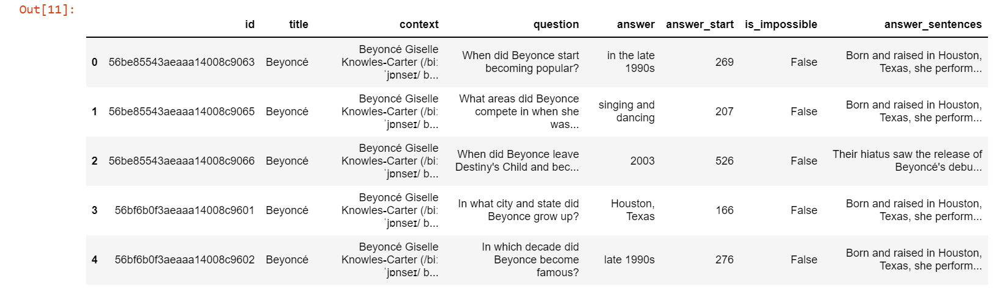

# Question Answering model

## Approach 1: Infomation Retrival

### Methodology

#### 1.1 Dataset

- Dataset snapshot:

- But this dataset has only answer phrases so for evaluvating the results from IR approach i had to get the entire sentence from  the context that has the answer phrase.
- Once processed it looks like

#### 1.2 Creating the corpus

- The corpus was created by combining all the sentences from the context and questions in the training dataset.
- The processed corpus was created by replacing less frequent words with unknown token and using gensim's `simple_preprocess`.

#### 1.3 Training

- The word2vec model was trained on the processed corpus.
- The Fasttext model was trained on the raw corpus and the processed corpus.

#### 1.4 Calculating similarity

- The context was first broken into sentences using nltk `sent_tokenizer`.
- Unknown words were replaced with unknown tokens.
- Then it was encoded into vectors using the word2vec or fasttext mdoels.
- The question was then encoded into vectors the same way.
- Finally the cosine similarity was used to calculate the similarity between each sentence in the context and question.
- `argmax` was used to find the sentence in the context which had the maximum similarity with the question.

#### 1.5 Evaluating

- For evaluating the results of the IR approach we will use the previously obtained the answer sentences.
- And then it will compare the argmaxed sentence with the obtained answer sentence.

#### 1.6 Results

| Model                        | train accuracy           | val accuracy |
| ---------------------------- | ------------------------ | ------------ |
| word2vec on context+Question with low freq words replaced | 71.2%                    | 72.5%        |
| word2vec-google-news-300     | NA(took too long to run) | 72.2%        |
| Fasttext on context+Question with low freq words replaced | 71%                      | 71%          |
| Fasttext on context+Question without replacement | 70.9%                      | 70.8%          |

### Questions

1. Using pretrained models to get word vectors and transform to sentence vectors seem to take a lot of time, my doubt is why?
2. Net im going to experiment with BERT and variations of it, can you please send me some reading materials on it, if possible? - multi modal encoders
3. Finally, I'm also going to look into sequence to sequence of models, so any materials on that will be greatly appreciated. - pre trained models and check
4. Also, please let me know if im going in the right track or I need to address any major concerns?